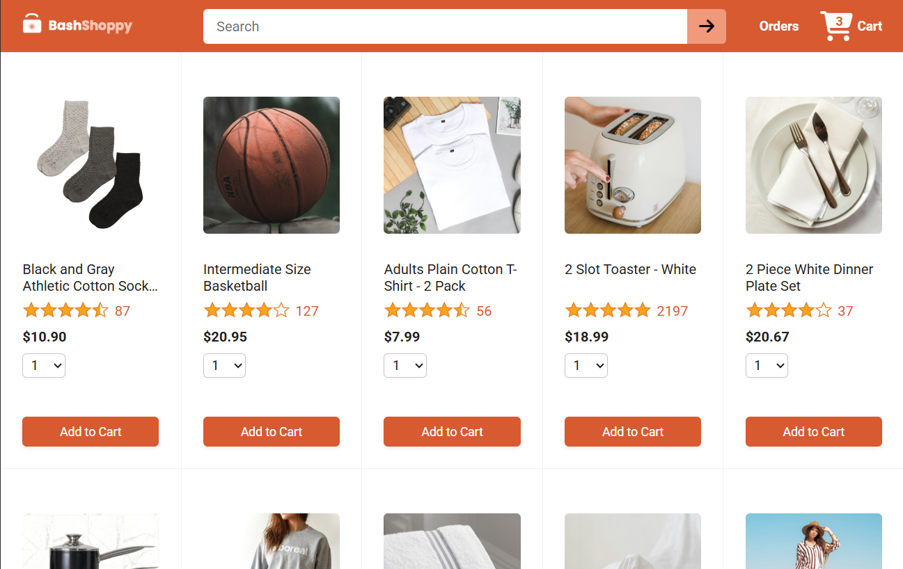
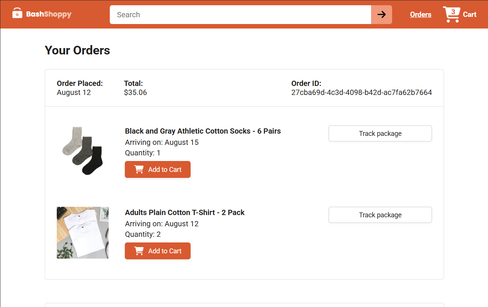
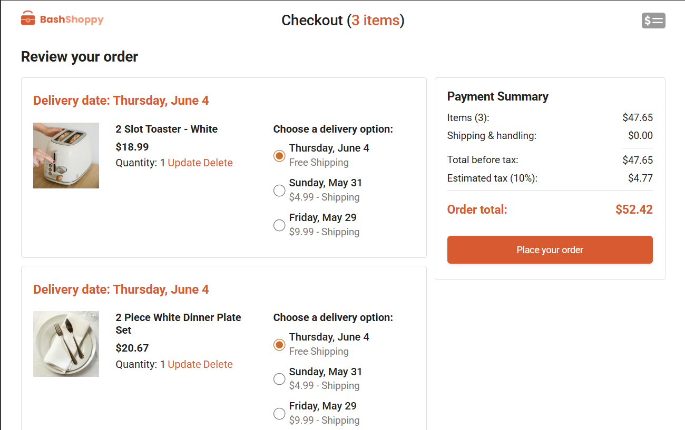
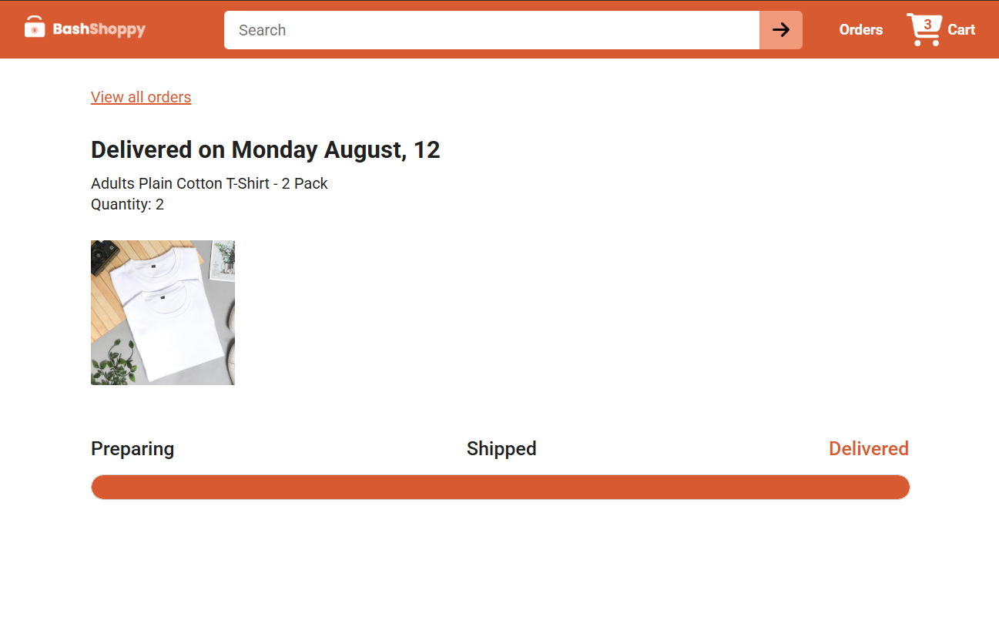

# Ecommerce Website

A full-stack ecommerce application built with React, TypeScript, Node.js, and Express.  
The application allows users to browse products, manage cart items, place orders, and track deliveries through a responsive user interface and RESTful backend APIs.

---

## 🚀 Features

### Frontend
- Product listing and browsing
- Product search functionality
- Server-side filtering
- Checkout process
- Order management
- Order tracking
- Responsive UI design
- Page and component testing with Vitest and Testing Library

### Backend
- REST API for ecommerce operations
- Product management
- Cart management (add, update, remove items)
- Order creation and tracking
- Delivery options handling
- Payment summary calculation
- Static image serving
- Database seeding with default data
- Production-ready frontend serving

---

## 🧱 Architecture

```bash
client (React + vite)
        ↓
API (Node.js + Express)
        ↓
Database (SQLite)
```

### Frontend Responsibilities
- User interface
- Routing
- API consumption
- State management

### Backend Responsibilities
- Business logic
- Database operations
- API endpoints
- Order processing

---

## 🛠️ Tech Stack

### Frontend
- React
- Vite
- React Router
- Axios
- Day.js
- Vitest
- Testing Library

### Backend
- Node.js
- Express.js
- Sequelize ORM
- SQLite
- CORS
- ES Modules

---

## 📄 Pages

- **Home Page** - Displays all available products
- **Checkout Page** - Handles cart and order checkout
- **Order Page** - Displays user order information
- **Tracking Page** - Tracks delivery status

---

## 📦 Database Seeding

On first server startup, the database automatically seeds default data including:

- Products
- Delivery Options
- Cart Items
- Orders

---

## ⚡ API Features

- Product APIs
- Cart APIs
- Order APIs
- Delivery Option APIs
- Payment Summary APIs

---

## 🔧 Installation

### Clone Repository

```bash
git clone https://github.com/Info-Bash/ecommerce-app.git
```

### Frontend Setup

```bash
cd ecommerce-website
npm install
npm run dev
```

### Backend Setup

```bash
cd ecommerce-backend
npm install
npm run dev
```

---


## 📸 Screenshots

<p align="center">
  
  <br/>
  <em>Home Page</em>
</p>

<p align="center">
  
  <br/>
  <em>Order Page</em>
</p>

<p align="center">
  
  <br/>
  <em>Checkout Page</em>
</p>

<p align="center">
  
  <br/>
  <em>Order Tracking Page</em>
</p>

---

## 🌍 Live Demo

https://ecommerce-app-topaz-six-31.vercel.app/

---

## 📌 Future Improvements

* Authentication and user accounts
* Payment gateway integration
* Wishlist feature
* Product reviews and ratings
* Admin dashboard
* Order history
* Email notifications

---